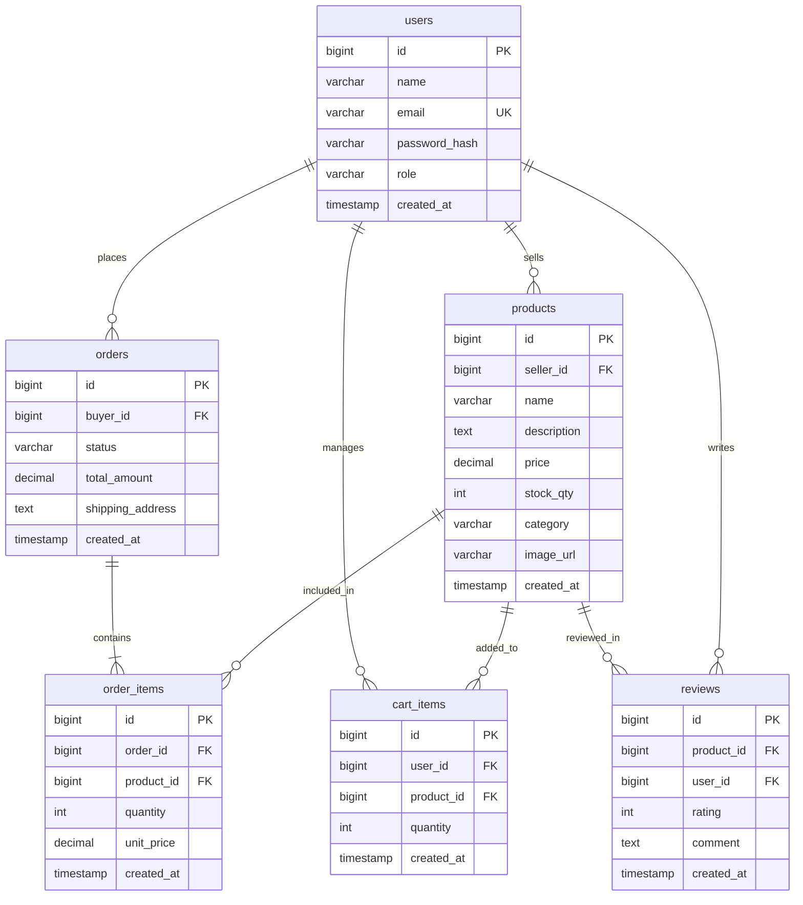
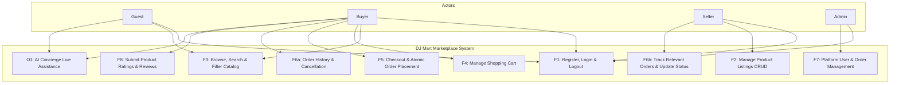
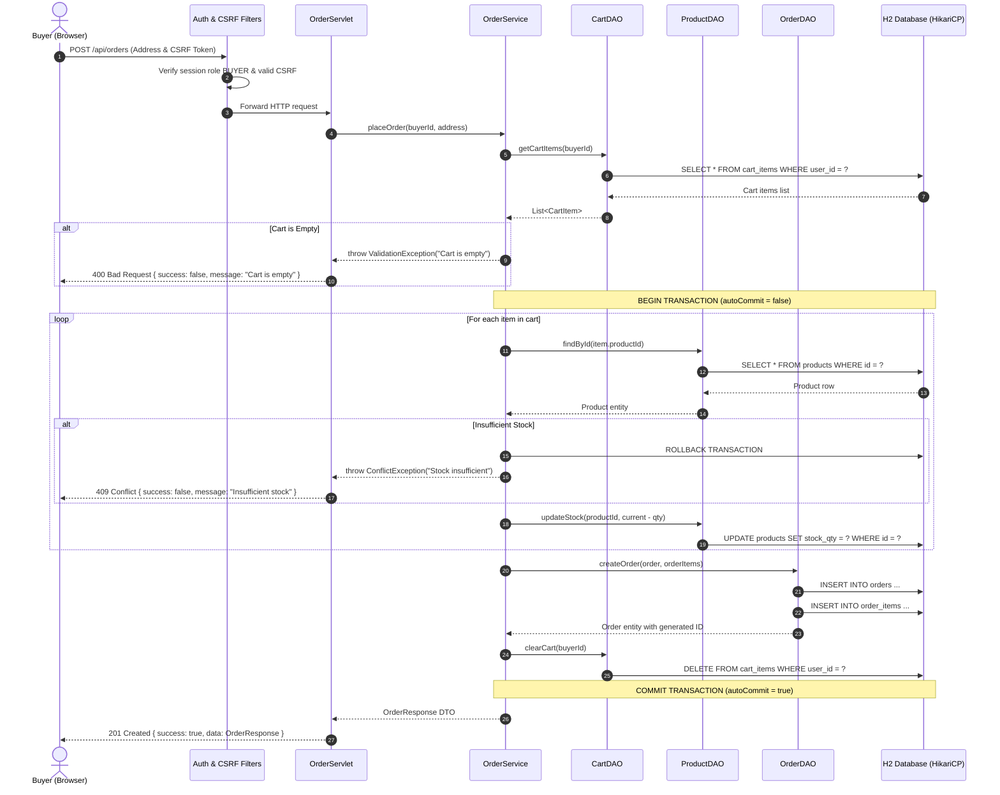
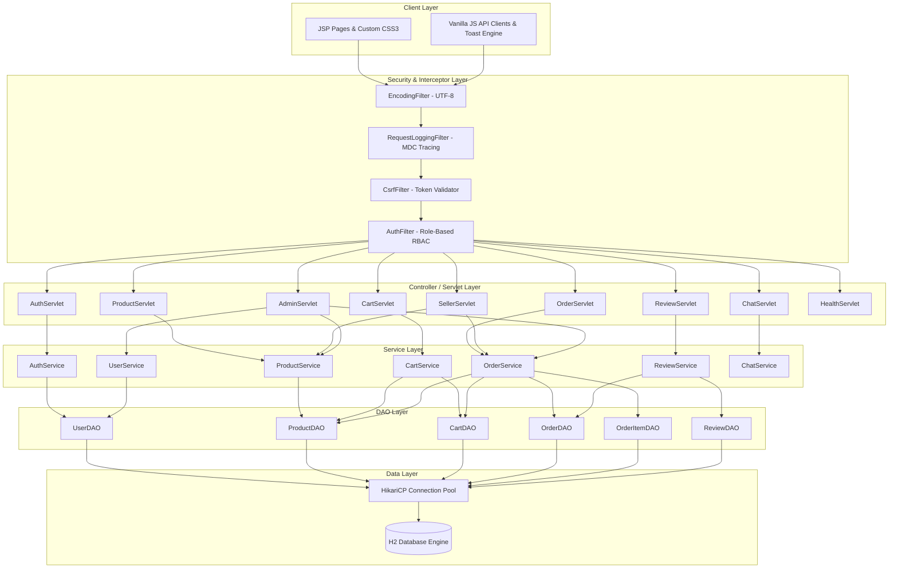

# DJ Mart — Modern AI-Powered E-Commerce Marketplace

[](https://github.com/djnir/DJ Mart/actions/workflows/build.yml)


-brightgreen.svg)

> **Live Public URL**: [https://assessed-mozilla-involves-limousines.trycloudflare.com](https://assessed-mozilla-involves-limousines.trycloudflare.com)  
> **Architecture**: Layered MVC with Pure Jakarta EE 10 Servlets 6.0, JSP/JSTL, Raw JDBC, HikariCP, and DatabaseAwareChatEngine  
> **Target Container**: Apache Tomcat 10.1.x | **Database**: Dual H2 Engine & PostgreSQL Support  
> **Default Test Credentials**: `buyer.john@djmart.com` / `Password@123`, `admin@djmart.com` / `Password@123`

---

## Table of Contents
1. [Project Overview](#1-project-overview)
2. [Technology Stack](#2-technology-stack)
3. [System Architecture](#3-system-architecture)
4. [System Diagrams](#4-system-diagrams)
   - [D1: Entity Relationship Diagram](#d1-entity-relationship-er-diagram)
   - [D2: Use Case Diagram](#d2-use-case-diagram)
   - [D3: Place Order Sequence Diagram](#d3-place-order-sequence-diagram)
   - [Layered Architecture Diagram](#layered-architecture-diagram)
5. [Core Features & Business Rules](#5-core-features--business-rules)
6. [Security Implementation](#6-security-implementation)
7. [Database Setup & Schema](#7-database-setup--schema)
8. [Default Development Accounts](#8-default-development-accounts)
9. [API Overview](#9-api-overview)
10. [Local Development & Setup Guide](#10-local-development--setup-guide)
11. [Tomcat Deployment Instructions](#11-tomcat-deployment-instructions)
12. [Maven & Verification Commands](#12-maven--verification-commands)
13. [Capstone Requirement Checklist](#13-capstone-requirement-checklist)

---

## 1. Project Overview

**DJ Mart** is a comprehensive, production-ready multi-seller e-commerce web platform developed without monolithic frameworks (such as Spring Boot or Hibernate). Built using explicit, modular Java enterprise fundamentals, DJ Mart provides full-featured marketplace capabilities:

- **Multi-Role RBAC**: Independent user experiences and secured authorization for **Buyers**, **Sellers**, and **Administrators**.
- **Transactional Consistency**: Atomic multi-step checkout with server-side inventory locking and automatic rollback on failure.
- **Classic Luxury Aesthetic**: A distinctive, editorial-grade UI crafted purely in semantic HTML5, CSS3, and Vanilla JavaScript—free of heavy frontend component dependencies.
- **AI Shopping Concierge**: An embedded customer assistance drawer supporting real-time catalog inquiries, shipping FAQs, and order guidance with intelligent offline and LLM fallbacks.

---

## 2. Technology Stack

| Layer / Concern | Technology / Library | Version / Details |
|---|---|---|
| **Language** | Java SE Development Kit | **Java 17 LTS** (`release: 17`) |
| **Servlet Container** | Apache Tomcat | **9.0.x** (`javax.servlet` Servlet 4.0 API) |
| **View Template Engine**| JavaServer Pages (JSP) & JSTL | **JSP 2.3 / JSTL 1.2** (Strict HTML escaping) |
| **Frontend Styling** | Custom CSS3 | Classical Luxury Theme (No Bootstrap / Tailwind) |
| **Frontend Scripting** | Vanilla JavaScript (ES6+) | Modern Fetch API, dynamic DOM, custom toast alerts |
| **Persistence / Data** | Pure JDBC with PreparedStatements | SQL injection proof; zero string concatenation |
| **Database Engine** | H2 Database Engine | **2.2.224** (Embedded & Server modes) |
| **Connection Pooling**| HikariCP | **5.1.0** (High-throughput, leak detection) |
| **JSON Serialization** | Google Gson | **2.10.1** (Custom LocalDateTime adapters) |
| **Password Hashing** | jBCrypt | **0.4** (Blowfish crypt with 10 salt rounds) |
| **Logging Framework** | SLF4J + Logback | **2.0.12 / 1.4.14** with MDC Request Tracing |
| **Test Automation** | JUnit 5 + Mockito | **5.10.2 / 5.11.0** (125 automated tests) |
| **Build & CI/CD** | Apache Maven & GitHub Actions | Maven 3.9+, Temurin JDK 17, `mvn clean verify` |

---

## 3. System Architecture

DJ Mart adheres to a strict **Layered MVC / Front Controller Architecture**:

```
                       HTTP Requests (Browser / AJAX)
                                      │
                                      ▼
                      ┌───────────────────────────────┐
                      │    EncodingFilter (UTF-8)     │
                      └───────────────┬───────────────┘
                                      ▼
                      ┌───────────────────────────────┐
                      │ RequestLoggingFilter (MDC ID) │
                      └───────────────┬───────────────┘
                                      ▼
                      ┌───────────────────────────────┐
                      │    CsrfFilter (Per-session)   │
                      └───────────────┬───────────────┘
                                      ▼
                      ┌───────────────────────────────┐
                      │    AuthFilter (RBAC Guard)    │
                      └───────────────┬───────────────┘
                                      │
                   ┌──────────────────┴──────────────────┐
                   ▼                                     ▼
        ┌─────────────────────┐               ┌─────────────────────┐
        │ Traditional Servlets│               │    REST Servlets    │
        │  (HTML View Routes) │               │   (/api/* Endpoints)│
        └──────────┬──────────┘               └──────────┬──────────┘
                   │ Forward                             │ JSON Response
                   ▼                                     ▼
          [JSP / JSTL Views]                    [ApiResponse<T> (Gson)]
                   │                                     │
                   └──────────────────┬──────────────────┘
                                      ▼
                      ┌───────────────────────────────┐
                      │         Service Layer         │
                      │ (Validation & Transactions)   │
                      └───────────────┬───────────────┘
                                      ▼
                      ┌───────────────────────────────┐
                      │           DAO Layer           │
                      │  (PreparedStatements Only)   │
                      └───────────────┬───────────────┘
                                      ▼
                      ┌───────────────────────────────┐
                      │    HikariCP Connection Pool   │
                      └───────────────┬───────────────┘
                                      ▼
                      ┌───────────────────────────────┐
                      │       H2 Database Engine      │
                      └───────────────────────────────┘
```

---

## 4. System Diagrams

### D1: Entity Relationship (ER) Diagram
Source PUML: [`docs/diagrams/D1_ER_Diagram.puml`](docs/diagrams/D1_ER_Diagram.puml)



---

### D2: Use Case Diagram
Source PUML: [`docs/diagrams/D2_UseCase_Diagram.puml`](docs/diagrams/D2_UseCase_Diagram.puml)



---

### D3: Place Order Sequence Diagram
Source PUML: [`docs/diagrams/D3_Sequence_Diagram.puml`](docs/diagrams/D3_Sequence_Diagram.puml)



---

### Layered Architecture Diagram
Source Doc: [`docs/architecture.md`](docs/architecture.md)



---

## 5. Core Features & Business Rules

### F1: User Authentication & Authorization
- **Registration**: Validates name, RFC-compliant email, and passwords (min 8 characters). Enforces unique email check.
- **BCrypt Hashing**: Cryptographically strong one-way hashing with 10 salt rounds (`jBCrypt`). Passwords are never stored in plaintext.
- **Session Security**: Defends against session fixation by regenerating the session identifier upon successful login (`request.changeSessionId()` with fallback regeneration). Invalidation on logout.
- **Role-Based Access Control**:
  - `BUYER`: Browse catalog, cart management, checkout, personal order history, eligible product reviews.
  - `SELLER`: Access dedicated Seller Dashboard, manage own product inventory, track relevant orders, update fulfillment states.
  - `ADMIN`: Access platform Admin Panel, oversee all users and roles, audit all orders and listings.

### F2: Product Inventory Management (Sellers)
- **Ownership Enforcement**: Sellers can only edit, restock, or delete listings linked to their own `seller_id`.
- **Validation**: Strict server-side verification: positive price (`> 0.00`), non-negative stock (`>= 0`), and non-empty category.

### F3: Product Catalog, Search & Filtering
- **Catalog Exploration**: Paginated product grid displaying image, name, category, price, star ratings, and real-time stock status.
- **Multi-parameter Search**: Full-text keyword querying combined with category filtering and sorting (Price ASC/DESC, Newest, Name).

### F4: Shopping Cart Operations
- **Stock Safeguard**: Adding or incrementing quantities is strictly checked against available warehouse stock.
- **Server Calculation**: Cart subtotals and order totals are computed exclusively server-side. Client-submitted prices are rejected.

### F5: Transactional Checkout Engine
Implements an **atomic 10-step transaction**:
1. Retrieve active user cart items.
2. Confirm cart is not empty.
3. Reload current product prices and lock stock.
4. Verify stock availability for all cart items.
5. Compute total amount server-side.
6. Insert parent `orders` record.
7. Insert child `order_items` records with historical unit prices.
8. Decrement product stock quantities.
9. Delete items from `cart_items`.
10. Commit transaction. (Automatic rollback if any failure occurs).

### F6: Order Management & Status Tracking
- **Buyer Flow**: View order history, item breakdowns, total paid, and cancel orders currently in `PENDING` status.
- **Seller Flow**: View incoming line items for products belonging to the seller and update permitted status transitions (`PENDING` $\to$ `CONFIRMED` $\to$ `SHIPPED` $\to$ `DELIVERED`).

### F7: Admin Dashboard & Platform Oversight
- Real-time aggregate KPIs: Total platform revenue, active user count, total orders placed, low-stock catalog alerts.
- User management table with role auditing.

### F8: Verified Buyer Reviews
- Review submission is restricted to buyers who have a verified `DELIVERED` order containing the specific product.
- Prevents duplicate reviews per user per product (`uq_review_product_user`).
- Supports ratings from 1 to 5 stars with customer comments.

### O1: AI Shopping Concierge (Optional Phase 3)
- Floating customer concierge drawer in the footer.
- Responds to catalog queries, order status help, and return policies.
- Architecture: `ChatProvider` abstraction with `MockChatProvider` (offline intelligent responses) and `GeminiChatProvider` (Google Gemini API integration).
- Enforces per-session rate limits (10 requests/minute) and maximum input size (500 characters).

---

## 6. Security Implementation

1. **SQL Injection Prevention**: 100% of database interactions utilize parameterized `PreparedStatement` within try-with-resources. Zero string concatenation.
2. **Cross-Site Scripting (XSS)**: All user-supplied data in JSP views is escaped using `<c:out value="..."/>` or `fn:escapeXml`. REST API outputs sanitize plain text.
3. **Cross-Site Request Forgery (CSRF)**: `CsrfFilter` generates a cryptographically secure token per session, embedded in form inputs (`_csrf`) and AJAX request headers (`X-CSRF-Token`).
4. **Session Fixation Prevention**: Session ID is replaced on authentication. Inactive sessions time out after 30 minutes.
5. **IDOR & Authorization Guards**: `AuthFilter` and service-layer ownership checks prevent users from viewing other users' private orders or modifying products owned by other sellers.
6. **Defense in Depth**: Passwords and secrets are omitted from logs and API payloads. Sensitive files are excluded via `.gitignore`.

---

## 7. Database Setup & Schema

DJ Mart runs seamlessly on **H2 Database Engine** in both embedded mode (for development/testing) and server mode.

### Schema DDL (`db/schema.sql` and `schema.sql`)
The database consists of 6 primary normalized tables:
- `users`: ID, Name, Unique Email, Password Hash, Role, Timestamp.
- `products`: ID, Seller ID (FK), Name, Description, Price, Stock, Category, Image URL, Timestamp.
- `orders`: ID, Buyer ID (FK), Status, Total Amount, Shipping Address, Timestamp.
- `order_items`: ID, Order ID (FK), Product ID (FK), Quantity, Unit Price, Timestamp.
- `cart_items`: ID, User ID (FK), Product ID (FK), Quantity, Timestamp.
- `reviews`: ID, Product ID (FK), User ID (FK), Rating (1-5), Comment, Timestamp.

Includes indexes on all foreign keys, category, price, order status, and order creation date for query performance.

---

## 8. Default Development Accounts

All development and test accounts in `db/seed.sql` and `seed.sql` are pre-seeded with the uniform password:

> **Password**: `Password@123`

| Role | Name | Email | Default Dashboard / Action |
|---|---|---|---|
| **ADMIN** | System Administrator | `admin@DJ Mart.com` | `/admin/dashboard` (System KPIs & Users) |
| **SELLER** | Tech Trends Official | `seller.tech@DJ Mart.com` | `/seller/dashboard` (Electronics Inventory) |
| **SELLER** | Urban Style Studio | `seller.style@DJ Mart.com` | `/seller/dashboard` (Fashion Inventory) |
| **BUYER** | John Doe | `buyer.john@DJ Mart.com` | `/products` / `/orders` (Delivered Orders) |
| **BUYER** | Sarah Connor | `buyer.sarah@DJ Mart.com` | `/cart` (Active Cart Items) |

---

## 9. API Overview

All JSON endpoints return standardized responses conforming to `ApiResponse<T>`:

```json
{
  "success": true,
  "message": "Operation completed successfully",
  "data": { ... },
  "errorCode": null
}
```

### Key Endpoints

| Method | Endpoint | Access Role | Description |
|---|---|---|---|
| `POST` | `/api/v1/auth/login` | Public | Authenticate user, regenerate session |
| `POST` | `/api/v1/auth/register` | Public | Register new user account |
| `GET` | `/api/v1/auth/me` | Authenticated | Fetch current user session details |
| `GET` | `/api/v1/products` | Public | Search/filter products (`page`, `category`, `sort`) |
| `GET` | `/api/v1/products/{id}` | Public | Retrieve single product details & rating |
| `POST` | `/api/v1/products` | `SELLER`, `ADMIN` | Create new product listing |
| `PUT` | `/api/v1/products/{id}` | `SELLER`, `ADMIN` | Update owned product listing |
| `DELETE`| `/api/v1/products/{id}` | `SELLER`, `ADMIN` | Delete owned product listing |
| `GET` | `/api/v1/cart` | `BUYER` | Get active user cart and server calculated totals |
| `POST` | `/api/v1/cart/items` | `BUYER` | Add product to cart |
| `PUT` | `/api/v1/cart/items/{id}`| `BUYER` | Update item quantity in cart |
| `DELETE`| `/api/v1/cart/items/{id}`| `BUYER` | Remove item from cart |
| `POST` | `/api/v1/checkout` | `BUYER` | Execute 10-step atomic order placement |
| `GET` | `/api/v1/orders` | `BUYER`, `ADMIN` | View order history |
| `GET` | `/api/v1/orders/{id}` | `BUYER`, `ADMIN` | View specific order details |
| `POST` | `/api/v1/orders/{id}/cancel` | `BUYER` | Cancel order in `PENDING` state |
| `POST` | `/api/v1/orders/{id}/status` | `SELLER`, `ADMIN` | Transition order status |
| `GET` | `/api/v1/reviews` | Public | Get reviews for a product |
| `POST` | `/api/v1/reviews` | `BUYER` | Submit review (requires verified purchase) |
| `POST` | `/api/chat` | Public | AI Concierge customer assistance |
| `GET` | `/api/v1/health` | Public | Database & pool connectivity health check |

---

## 10. Local Development & Setup Guide

### Prerequisites
- **JDK 17** (Temurin or Oracle) configured in `JAVA_HOME`
- **Apache Maven 3.8+**
- **Git**

### Step-by-Step Execution
1. **Clone the repository**:
   ```bash
   git clone https://github.com/djnir/DJ Mart.git
   cd DJ Mart
   ```

2. **Configure Environment Variables**:
   Copy `.env.example` to `.env` if custom ports or external database settings are required:
   ```bash
   cp .env.example .env
   ```

3. **Execute Full Automated Test Suite**:
   ```bash
   mvn clean test
   ```
   *(All 125 unit and integration tests run against isolated in-memory H2 databases).*

4. **Verify & Package Application**:
   ```bash
   mvn clean verify
   ```
   This compiles, tests, packages, and verifies the deployable archive at `target/DJ Mart.war`.

---

## 11. Tomcat Deployment Instructions

DJ Mart is packaged as a standard Web Application Archive (`.war`) targetable to **Apache Tomcat 9.0.x**.

1. **Download and Extract Tomcat 9.0.x**:
   Ensure Tomcat 9 is installed and configured to run on Java 17.

2. **Deploy the WAR File**:
   Copy the built WAR artifact into Tomcat's deployment directory:
   ```bash
   cp target/DJ Mart.war /path/to/apache-tomcat-9.x/webapps/
   ```

3. **Start Tomcat**:
   - **Linux / macOS**:
     ```bash
     /path/to/apache-tomcat-9.x/bin/startup.sh
     ```
   - **Windows PowerShell**:
     ```powershell
     & "C:\path\to\apache-tomcat-9.x\bin\startup.bat"
     ```

4. **Access DJ Mart Marketplace**:
   Open your browser to:
   ```
   http://localhost:8080/DJ Mart
   ```
   - Sign in with any seed account (e.g., `buyer.john@DJ Mart.com` / `Password@123`).
   - Check health status at `http://localhost:8080/DJ Mart/api/v1/health`.

---

## 12. Maven & Verification Commands

```bash
# Clean project and compile all source files
mvn clean compile

# Execute complete test suite (Unit & Integration tests)
mvn test

# Run build verification, test suite, and generate WAR package
mvn clean verify

# Produce standalone WAR archive for Tomcat deployment
mvn clean package

# Run with custom Maven offline mode (if dependencies are cached)
mvn test -o
```

---

## 13. Capstone Requirement Checklist

| Requirement Code | Description | Implementation File(s) | Test / Verification Evidence | Status |
|---|---|---|---|---|
| **F1** | User Authentication & BCrypt | `AuthServiceImpl.java`, `AuthServlet.java` | `AuthServiceTest.java`, `AuthServletTest.java` | **PASSED** |
| **F1-RBAC** | Role-Based Access Control | `AuthFilter.java`, `Role.java` | `AuthFilterTest.java`, `EndToEndFlowIntegrationTest.java` | **PASSED** |
| **F2** | Seller Product Management CRUD | `ProductServiceImpl.java`, `SellerServlet.java` | `ProductServiceTest.java`, `SellerServletTest.java` | **PASSED** |
| **F3** | Catalog Search, Filter, Sort | `ProductDAOImpl.java`, `ProductServlet.java` | `ProductDAOTest.java`, `ProductServletTest.java` | **PASSED** |
| **F4** | Shopping Cart with Stock Guard | `CartServiceImpl.java`, `CartServlet.java` | `CartServiceTest.java`, `CartServletTest.java` | **PASSED** |
| **F5** | Atomic Transaction Checkout | `OrderServiceImpl.java`, `OrderServlet.java` | `OrderServiceTest.java`, `OrderServletTest.java` | **PASSED** |
| **F6** | Order Tracking & Cancellation | `OrderServiceImpl.java`, `OrderDAOImpl.java` | `OrderDAOTest.java`, `EndToEndFlowIntegrationTest.java` | **PASSED** |
| **F7** | Admin Metrics & Management | `AdminServlet.java`, `UserDAOImpl.java` | `AdminServletTest.java` | **PASSED** |
| **F8** | Verified Buyer Reviews | `ReviewServiceImpl.java`, `ReviewServlet.java` | `ReviewServiceTest.java`, `ReviewServletTest.java` | **PASSED** |
| **O1** | AI Customer Support Concierge | `ChatServlet.java`, `ChatServiceImpl.java` | `ChatServletTest.java`, Manual widget verification | **PASSED** |
| **O2** | System Health Check Endpoint | `HealthServlet.java` (`/api/v1/health`) | `HealthServletTest.java` | **PASSED** |
| **O3** | Security (CSRF, XSS, Fixation) | `CsrfFilter.java`, `AuthFilter.java`, JSTL `<c:out>`| `CsrfFilterTest.java`, Security audit | **PASSED** |
| **O4** | Standard ApiResponse Envelope | `ApiResponse.java`, `BaseServlet.java` | Centralized JSON testing across all servlets | **PASSED** |
| **D1-D3** | Architecture & UML Diagrams | `docs/diagrams/*.puml` & Mermaid blocks | Rendered in README.md and documentation files | **PASSED** |
| **CI** | GitHub Actions Pipeline | `.github/workflows/build.yml` | Verified `mvn -B clean verify` on Temurin JDK 17 | **PASSED** |

---

*Engineered with precision for the Anna University R2025 Semester 3 Capstone Evaluation.*
"# Capstone" 
